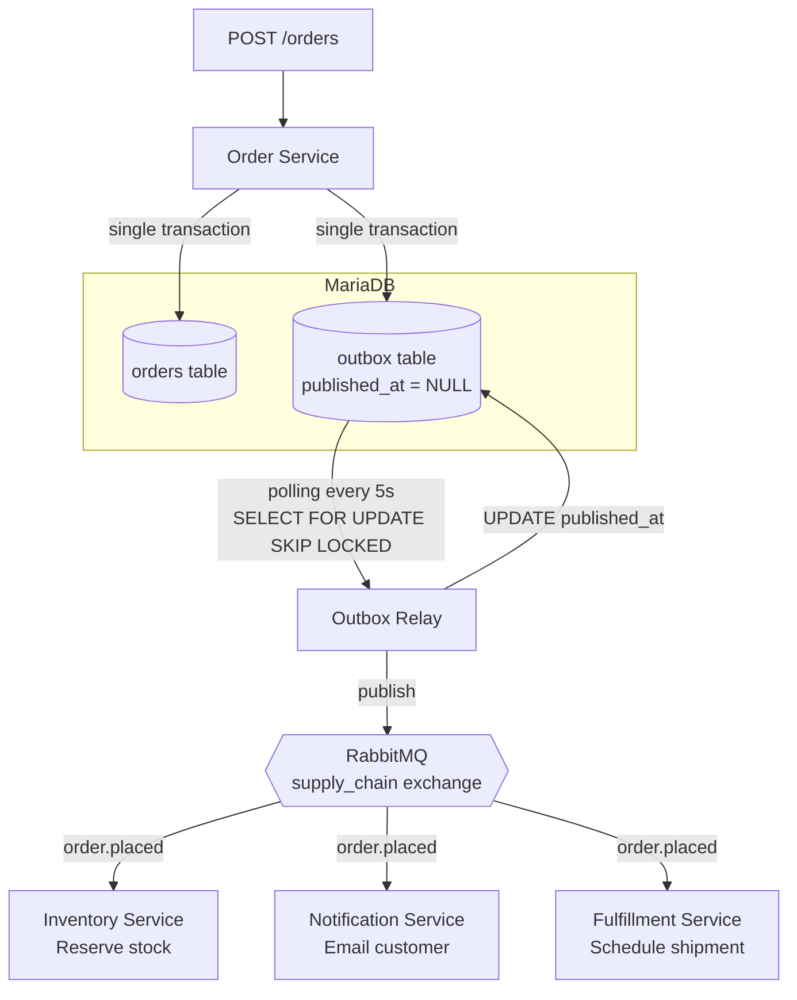

# transactional-outbox-mariadb

> Guaranteed event delivery for a supply chain sales order flow — a production-style implementation of the transactional outbox pattern in Go, MariaDB, and RabbitMQ.

---

## Why this exists

In an event-driven microservices architecture, writing to your database and publishing an event are two separate operations. If your service crashes between them, you get one without the other — an order saved with no downstream notification, or an event fired for an order that never committed.

The naive fix is to do both and hope. The production fix is the **transactional outbox pattern**.

This repository implements that pattern against a supply chain sales order flow. It is intentionally scoped: one bounded context, one business event (`OrderPlaced`), three downstream consumers. The goal is a clean, readable reference — not a framework, not a starter kit.

**MariaDB specifically** — almost every outbox implementation you'll find uses Postgres. This repo targets MariaDB, which is still widely deployed in organisations running LAMP-era infrastructure or migrating off MySQL. The polling mechanism, schema, and relay logic are documented with MariaDB's behaviour in mind.

---

## How it works

When an order is placed, the Order Service writes to two tables inside a **single database transaction**:

```
BEGIN;
  INSERT INTO orders  (id, customer_id, product_sku, quantity, status) VALUES (...);
  INSERT INTO outbox  (id, event_type, aggregate_id, payload)          VALUES (...);
COMMIT;
```

If the transaction commits, both writes are guaranteed. If it rolls back, neither exists. There is no window where the state is inconsistent.

A separate **Outbox Relay** process polls the outbox table on a configurable interval, publishes unpublished events to RabbitMQ, and marks them as published only after the broker acknowledges receipt. Downstream services — Inventory, Notification, and Fulfillment — consume from their own queues and process independently.

---

## Architecture



---

## Sales order flow

1. Client sends `POST /orders` with customer ID, product SKU, and quantity
2. Order Service validates the request
3. A single database transaction writes the order record and an `OrderPlaced` event to the outbox
4. The transaction commits — both writes are durable, or neither is
5. The Outbox Relay polls the outbox table every 5 seconds for rows where `published_at IS NULL`
6. Each pending event is published to the `supply_chain` RabbitMQ topic exchange with routing key `order.placed`
7. The relay marks the event as published — only after the broker confirms receipt
8. Inventory, Notification, and Fulfillment services each consume from their own durable queue bound to the exchange

---

## Tech stack

| Concern | Choice | Notes |
|---|---|---|
| Language | Go | Idiomatic use of `database/sql`, `slog`, goroutines |
| Database | MariaDB 10.11 | Polling via `SELECT ... FOR UPDATE SKIP LOCKED` |
| Migrations | goose | SQL-based, version-controlled |
| Message broker | RabbitMQ 3 | Topic exchange, durable queues |
| Containerisation | Docker Compose | Single command to run everything |

---

## Getting started

**Prerequisites**: Docker and Docker Compose.

```bash
git clone https://github.com/your-username/transactional-outbox-mariadb.git
cd transactional-outbox-mariadb

cp .env.example .env
docker compose up --build
```

All services start, migrations run automatically, and the relay begins polling. The RabbitMQ management UI is available at [http://localhost:15672](http://localhost:15672) (guest / guest).

**Place an order:**

```bash
curl -X POST http://localhost:8080/orders \
  -H "Content-Type: application/json" \
  -d '{
    "customer_id": "cust-001",
    "product_sku": "SKU-WIDGET-A",
    "quantity": 3
  }'
```

**What to observe:**

- The order row appears in the `orders` table immediately
- A corresponding row appears in `outbox` with `published_at = NULL`
- Within ~5 seconds the relay publishes the event and sets `published_at`
- All three consumer services log receipt of the `OrderPlaced` event

---

## Event payload

```json
{
  "event_id":     "550e8400-e29b-41d4-a716-446655440000",
  "event_type":   "OrderPlaced",
  "aggregate_id": "order-uuid",
  "occurred_at":  "2025-06-01T09:00:00Z",
  "data": {
    "customer_id": "cust-001",
    "product_sku": "SKU-WIDGET-A",
    "quantity":    3,
    "status":      "PENDING"
  }
}
```

---

## Design decisions

**Polling over CDC** — Change Data Capture via Debezium is the production-scale approach and is documented in the roadmap. For v1, polling is simpler to reason about, easier to operate, and sufficient to demonstrate the pattern's guarantees. The relay interval and batch size are configurable via environment variables.

**At-least-once delivery** — If the relay publishes an event but crashes before marking it published, the event will be re-published on the next poll cycle. Consumers should be idempotent. A natural implementation is to check whether the `aggregate_id` has already been processed before acting on it.

**MariaDB over Postgres** — Most outbox pattern implementations assume Postgres. This project specifically targets MariaDB for teams running it in production who need a worked example. `SELECT ... FOR UPDATE SKIP LOCKED` is supported in MariaDB 10.6+. The `go-sql-driver/mysql` driver is compatible with MariaDB without modification.

**No dead-letter queue in v1** — If a consumer fails to process an event, RabbitMQ's default behaviour is to requeue it. A production system would configure a dead-letter exchange and alerting. That is out of scope here and called out explicitly so the gap is not mistaken for an oversight.

**Single Go workspace** — All services live in one repository under a `go.work` file. This is a pragmatic choice for a focused reference implementation. In a real organisation these would likely be separate repositories with their own release cycles.

---

## Roadmap

### v2 — CDC + Kafka

The polling relay will be replaced with a Change Data Capture pipeline using Debezium's MariaDB connector, publishing directly to Kafka. This eliminates the polling interval latency and scales to higher throughput without touching the application code.

The application-level guarantee — the single transaction writing to both `orders` and `outbox` — does not change. Only the relay mechanism changes. That is the point: the outbox pattern decouples your application from your event infrastructure.

See [ROADMAP.md](./ROADMAP.md) for the detailed upgrade plan and MariaDB-specific Debezium configuration notes.

---

## Contributing

Issues and pull requests are welcome. If you're implementing this pattern against a different database or broker, open a discussion — comparing notes on the MariaDB-specific behaviour is part of what this project is for.

---

## License

MIT